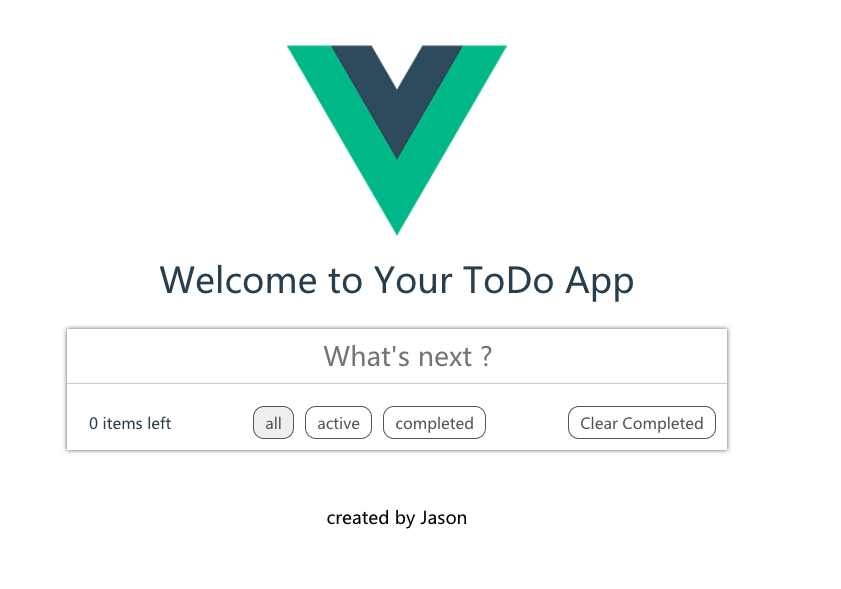

# todo-app

> A Webapp for todo list demo built on Vue-Cli

## Build Setup

``` bash
# install dependencies
npm install

# serve with hot reload at localhost:8080
npm run dev

# build for production with minification
npm run build

# build for production and view the bundle analyzer report
npm run build --report
```

> The todo app be used for :
> To create/delete the task you wanna do.
> To complete the task you have done.
> And there are the tabs to check the tasks you have created.

The interface is as below:




For a detailed explanation on how things work, check out the [guide](http://vuejs-templates.github.io/webpack/) and [docs for vue-loader](http://vuejs.github.io/vue-loader).
